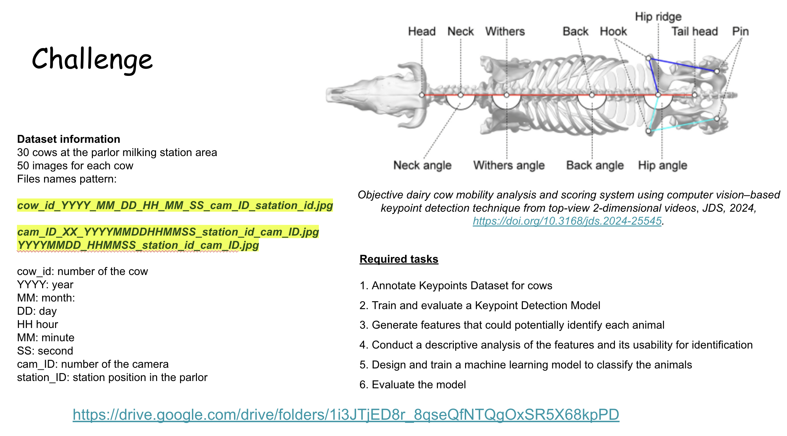

# Detecção de Vacas pelos Keypoints - Pose (YOLO, yolo26n-pose) + Identificação (XGBoost/CatBoost/RF/SVM/KNN/MLP/MLP-Torch/Siamese-Torch)

## Visão geral


Este repositório implementa um pipeline em 3 fases:

1. **Fase 1 - Pose/Keypoints (YOLO Pose)**  
   Converte anotações do Label Studio em formato YOLO Pose, treina um modelo para detectar **bbox de vaca** e **8 keypoints**, e disponibiliza inferência (JSON e opcionalmente imagem desenhada).

2. **Fase 2 - Geração de features (CSV)**  
   Usa o modelo de pose para extrair keypoints do `dataset_classificacao` e gerar um CSV com features geométricas por imagem (90% de cada vaca).  
   Inclui **seleção robusta da instância-alvo** na imagem (para o caso de existir uma segunda vaca parcialmente no frame).

3. **Fase 3 - Classificação da vaca (XGBoost/CatBoost/RF/SVM/KNN/MLP/MLP-Torch/Siamese-Torch)**  
   Treina um classificador tabular configurável via `classificacao.modelo_padrao` e avalia no “caso real” (10%), gerando **matriz de confusão** e métricas globais. Também suporta inferência em imagem única com top-k.

---

## Requisitos
- Python 3.10+ (recomendado)
- Dependências principais:
  - ultralytics
  - opencv-python
  - numpy, pandas
  - scikit-learn
  - matplotlib, seaborn
  - pyyaml
  - xgboost / catboost (classificação tabular)
  - fiftyone (auditoria visual de datasets e predições)
  - optuna (otimização de hiperparâmetros)
  - pydantic (validação de contratos/configuração)
  - tqdm (barra de progresso)
  - types-PyYAML (tipagem estática para YAML)
- GPU NVIDIA (opcional, recomendado): qualquer RTX com CUDA compatível.

---

## Instalação

### 1) Criar ambiente virtual
```bash
python -m venv .venv
# Windows
.venv\Scripts\activate
# Linux/Mac
source .venv/bin/activate
```

### 2) Instalar dependências e o projeto
```bash
pip install -e .
```
Isso instalará as dependências listadas no `pyproject.toml` e o próprio pacote `src` em modo editável.

Para usar a auditoria visual no FiftyOne:
```bash
pip install fiftyone
```

### 3) Configuração de GPU (CUDA) vs CPU
Este projeto roda tanto em CPU quanto em GPU. Para usar GPU:

1. Atualize o **driver NVIDIA**.
2. Verifique se o PyTorch reconhece sua GPU:
```bash
python -c "import torch; print(torch.cuda.is_available(), torch.cuda.get_device_name(0) if torch.cuda.is_available() else 'no-cuda')"
```
Se retornar `True` e o nome da GPU, tudo pronto.

Se retornar `False no-cuda`:
```bash
pip uninstall torch torchvision torchaudio -y
pip install torch torchvision torchaudio --index-url https://download.pytorch.org/whl/cu121
```
*(Ajuste `cu121` para a versão do seu CUDA, ex: cu118, cu124)*

#### Troubleshooting e GPUs Novas (RTX série 50)
- **CUDA mismatch**: reinstale com a versão correta.
- **Erro `cudaErrorNotSupported` ou warning de arquitetura**: Instale o build **Nightly** (ex: `cu128`):
```bash
pip uninstall torch torchvision torchaudio -y
pip install --pre torch torchvision torchaudio --index-url https://download.pytorch.org/whl/nightly/cu128
```
- **Out of memory (VRAM 8GB)**: Reduza `pose.batch` e `pose.imgsz` no `config.yaml`.

Para rodar **exclusivamente em CPU**, ajuste no `config/config.yaml`:

```yaml
pose:
  device: "cpu"

classificacao:
  xgboost:
    device: "cpu"
  catboost:
    device: "cpu"
  mlp_torch:
    device: "cpu"
  siamese_torch:
    device: "cpu"
```

Opcional para estabilidade/performance em Windows:
- `pose.workers: 0` (ou `2`).

---

## Estrutura de pastas (alto nível)
```text
dados/raw/
  dataset_keypoints/
  dataset_classificacao/
dados/processados/
  yolo_pose/
  classificacao/
modelos/
saidas/
src/
config/
```

Pastas auxiliares/geradas em execução:
```text
.venv/          # ambiente virtual local
build/          # artefatos de build/empacotamento
catboost_info/  # logs e artefatos temporários do CatBoost
_experimentos/  # execuções/rascunhos experimentais locais
_logs/          # logs auxiliares locais
```

---

## Formato dos datasets

### dataset_keypoints
```text
dados/raw/dataset_keypoints/
  <anotador>/
    ...imagens...
    Key_points/
      1 (arquivo JSON, pode não ter extensão .json)
      2
      ...
```
- Pode haver múltiplas vacas por imagem.
- Pontos fora do quadro **não aparecem** na anotação (tratados como inexistentes).
- Cenário real: filmagem **de cima** (não há uma vaca passando por cima de outra).  
  Pode haver **overlap leve de bordas** dos bboxes; por isso, a associação keypoint↔bbox usa tolerância (2–5 px).

#### O que é obrigatório vs opcional na estrutura
- **Obrigatório:**
  - arquivos de anotação válidos do Label Studio (JSON, com ou sem extensão `.json`);
  - imagens correspondentes às anotações, com nome de arquivo compatível.
- **Opcional (recomendado):**
  - organização por anotador com pasta `Key_points` (ex.: `<anotador>/Key_points/...`).

O parser atual procura anotações primeiro em `**/Key_points/*`.  
Se não encontrar, faz fallback para `**/*.json` em todo `dados/raw/dataset_keypoints`.

Na prática, você pode deixar **imagens + anotações tudo junto** em `dados/raw/dataset_keypoints`, desde que:
- os nomes das imagens sejam únicos (evitar arquivos homônimos em pastas diferentes);
- cada anotação referencie corretamente o nome da imagem.

O Dataset para Rotular encontra-se em: https://drive.google.com/drive/folders/1iigDLVXJ5WPgMsnjH5Foijmr19qTwuyg. 

**Importante:** Caso queira aproveitar o dataset já rotulado, com rotulação feita pelos alunos do Curso de Pós em IA aplicada do IFG/2025 já no formato correto, basta baixar o conteúdo de https://drive.google.com/drive/folders/1xfU7Yl_DH9hYd36IT5RfJ1Quhm8ijZr8 e colocá-lo na pasta dados/raw/dataset_keypoints.

---


### dataset_classificacao
```text
dados/raw/dataset_classificacao/
  <cow_number>/
    *.jpg
```
- Cada subpasta em `dataset_classificacao` representa **uma vaca** (ID/classe), e as imagens dentro dela são fotos dessa mesma vaca.
- ~50 imagens por vaca.

O dataset pode ser baixado em: https://drive.google.com/drive/folders/18bdtA7IN0lv84v6bTDopfJtCb2lFDPuH. Basta colocar seu conteúdo em dados/raw/dataset_classificacao.

---

## Configuração
Edite `config/config.yaml`.

Principais parâmetros (resumo prático):

- `paths.raw`, `paths.processed`, `paths.models`, `paths.outputs`: diretórios base de entrada, dados processados, modelos e saídas.

- `pose.model_name`: checkpoint inicial do YOLO Pose (ex.: `yolo26n-pose.pt`, `yolov8n-pose.pt`).
- `pose.imgsz`: resolução de treino/inferência da fase de pose.
- `pose.batch`: tamanho de lote do YOLO.
- `pose.epochs`: número máximo de épocas.
- `pose.patience`: early stopping da fase de pose (épocas sem melhora).
- `pose.device`: dispositivo (`"cpu"`, `"0"`, `"1"`, etc.).
- `pose.k_folds`: quantidade de folds na validação cruzada da pose.
- `pose.estrategia_validacao`: estratégia de split da pose (`kfold_misturado`, `groupkfold_por_sessao`, `groupkfold_por_anotador`).
- `pose.usar_data_augmentation`: liga/desliga augmentations do YOLO.
- `pose.augmentacao.*`: intensidades/probabilidades dos augmentations nativos (`hsv_*`, `degrees`, `translate`, `scale`, `shear`, `perspective`, `fliplr`, `flipud`, `mosaic`, `mixup`, `erasing`).

- `classificacao.modelo_padrao`: classificador tabular ativo (`xgboost`, `catboost`, `sklearn_rf`, `svm`, `knn`, `mlp`, `mlp_torch`, `siamese_torch`).
- `classificacao.split_teste`: fração reservada para teste final externo por vaca (ex.: `0.10`).
- `classificacao.features.selecionadas`: lista de features geométricas usadas no treino da classificação.
- `classificacao.usar_data_augmentation`: liga/desliga augmentation da fase de features/classificação.
- `classificacao.augmentacao_keypoints.*`: parâmetros da geração sintética via ruído gaussiano (`n_copias`, `noise_std_xy`, `conf_min_keypoint`, etc.).
- `classificacao.selecao_instancia.*`: critérios para escolher a vaca-alvo quando há múltiplas detecções (`conf_min`, pesos por área/confiança e centralidade).
- `classificacao.filtro_confianca_pose.*`: gate de qualidade da pose antes de gerar/classificar features (baseado na confiança média dos keypoints visíveis).
- `classificacao.rejeicao_predicao.*`: regra para retornar `NAO_IDENTIFICADO` na inferência (limiar de confiança top-1 e margem top1-top2).
- `classificacao.validacao_interna.fracao`: tamanho da validação interna dentro do treino externo.
- `classificacao.validacao_interna.early_stopping_rounds`: paciência de early stopping para modelos que suportam esse mecanismo.
- `classificacao.validacao_interna.usar_apenas_real`: força validação interna com amostras reais (sem augmentação), reduzindo viés de cópias sintéticas.
- `classificacao.otimizacao_hiperparametros.*`: ativa Optuna/busca aleatória e controla `n_trials`, `timeout` e `seed`.

Parâmetros mais críticos (referência rápida):

| Parâmetro | Impacto prático | Valor inicial recomendado |
|---|---|---|
| `pose.model_name` | Define capacidade/velocidade do detector de pose | `yolo26n-pose.pt` |
| `pose.device` | Define uso de GPU/CPU na fase de pose | `"0"` (GPU principal) |
| `pose.batch` | Afeta uso de VRAM e tempo por época | `16` (reduzir se faltar VRAM) |
| `pose.epochs` | Limite de treino da pose | `200` |
| `pose.patience` | Early stopping da pose | `50` |
| `classificacao.modelo_padrao` | Escolhe o classificador final | `"mlp_torch"` (baseline atual) |
| `classificacao.split_teste` | Tamanho do teste final externo | `0.10` |
| `classificacao.augmentacao_keypoints.n_copias` | Volume de dados sintéticos de treino | `10` |
| `classificacao.augmentacao_keypoints.noise_std_xy` | Intensidade do ruído nos keypoints | `0.004` |
| `classificacao.rejeicao_predicao.confianca_min` | Limiar para aceitar/rejeitar predição | `0.50` |


---

## Uso via CLI

O script `src/cli.py` é o ponto central de execução.

**Nota sobre Configuração:**
O argumento `--config` é **global e opcional**. Se não informado, usa `config/config.yaml`.
Para usar outro arquivo, passe-o **antes** do subcomando:
```bash
python -m src.cli --config meu_config.yaml <COMANDO>
```

### Comandos Disponíveis

#### 1. Pré-processamento (Fase 1)
Converte anotações do Label Studio (JSON) para formato YOLO Pose e cria `dataset.yaml`:
```bash
python -m src.cli preprocessar-pose
```

#### 2. Treinar Pose (Fase 1)
Inicia o treinamento do YOLO Pose (usando k-fold ou split simples definido no config):
```bash
python -m src.cli treinar-pose
```

#### 3. Inferir Pose (Teste Fase 1)
Roda o modelo de pose em uma imagem e opcionalmente desenha o esqueleto:
```bash
python -m src.cli inferir-pose --imagem "caminho/para/imagem.jpg" --desenhar
```
*A saída será salva em `saidas/inferencias/imagens_plotadas`.*

Para inspecionar o augmentation gaussiano de keypoints na mesma imagem:
```bash
python -m src.cli inferir-pose --imagem "caminho/para/imagem.jpg" --desenhar-augmentacao
```

Para controlar quantas cópias ruidosas desenhar no preview:
```bash
python -m src.cli inferir-pose --imagem "caminho/para/imagem.jpg" --desenhar-augmentacao --aug-copias 30
```

Esse modo salva um arquivo `<nome>_aug_preview.<ext>` em `saidas/inferencias/imagens_plotadas`,
com keypoints originais e as variações geradas por ruído gaussiano.

Exemplo completo (esqueleto + preview de augmentação na mesma execução):
```bash
python -m src.cli inferir-pose --imagem "caminho/para/imagem.jpg" --desenhar --desenhar-augmentacao --aug-copias 30
```

#### 4. Gerar Features (Fase 2)
Processa todas as imagens de `dataset_classificacao`, extrai keypoints e calcula as features geométricas (CSV):
```bash
python -m src.cli gerar-features
```

#### 5. Treinar Classificador (Fase 3)
Treina o modelo definido em `classificacao.modelo_padrao` e salva os artefatos do classificador (`xgboost_model.json`, `catboost_model.cbm`, `rf_model.joblib`, `svm_model.joblib`, `knn_model.joblib`, `mlp_model.joblib`, `mlp_torch_model.pt` + `mlp_torch_scaler.joblib` ou `siamese_torch_model.pt` + `siamese_torch_scaler.joblib`, além do encoder):
```bash
python -m src.cli treinar-classificador
```

#### 6. Avaliar Classificador (Fase 3)
Avalia o modelo treinado no conjunto de teste (10% isolado por vaca) e gera matriz de confusão:
```bash
python -m src.cli avaliar-classificador
```

#### 7. Classificar Imagem (End-to-End)
Executa o fluxo completo para uma nova imagem:
1. Detecta pose (YOLO).
2. Extrai features.
3. Classifica com o modelo definido em `classificacao.modelo_padrao` (`xgboost`, `catboost`, `sklearn_rf`, `svm`, `knn`, `mlp`, `mlp_torch` ou `siamese_torch`).
```bash
python -m src.cli classificar-imagem --imagem "cam/para/img.jpg" --top-k 3 --desenhar
```
*Gera JSON com probabilidades e salva imagem com predição.*

> **Importante:** Para evitar vazamento de dados (avaliar uma imagem que o modelo já viu no treino), utilize imagens listadas em `dados/processados/classificacao/splits/teste_10pct.txt`. Este arquivo contém os **nomes dos arquivos** (`arquivo.jpg`) reservados para teste.

#### 8. Pipeline Completo
Executa as etapas de pipeline de treino/avaliação em sequência (útil para reprodução total):
```bash
python -m src.cli pipeline-completo
```
Inclui:
- `preprocessar-pose`
- `treinar-pose`
- `gerar-features`
- `treinar-classificador`
- `avaliar-classificador`

Não inclui:
- `inferir-pose`
- `classificar-imagem`

Estas últimas, por não fazerem parte do pipeline principal, precisam ser acionadas manualmente, por comandos CLI já descritos acima.

#### 9. Análise Exploratoria de Features (EDA)
Executa uma analise descritiva do dataset de features, fora do pipeline principal:
```bash
python -m src.cli analisar-features
```
Saidas em `saidas/analise_features/` (graficos, CSVs e `relatorio_eda.md`).


**ENTREGÁVEL: Relatório de Análise Exploratória de Dados (EDA) [docs/analise_features.md](docs/analise_features.md).**

#### 10. Auditoria visual com FiftyOne (EDA visual)
Permite inspeção visual em 3 frentes:
1. `classificacao-teste`: GT x predição x confiança no split de teste.
2. `classificacao-raw`: auditoria de imagens em `dataset_classificacao` (classe/pasta incorreta).
3. `pose-anotacoes`: auditoria de bbox + keypoints do dataset YOLO processado.

Comandos:
```bash
python -m src.cli exportar-fiftyone --modo classificacao-teste
python -m src.cli exportar-fiftyone --modo classificacao-raw
python -m src.cli exportar-fiftyone --modo pose-anotacoes
```

Exportar tudo e abrir app:
```bash
python -m src.cli exportar-fiftyone --modo todos --launch
```

---

## Fase 1 - Pose/Keypoints (YOLO)

### Visão geral do pipeline da Fase 1
A Fase 1 transforma anotações do Label Studio em dataset YOLO Pose, treina o modelo e publica um artefato final para inferência.

Fluxo completo:
1. **Entrada bruta:** imagens + anotações em `dados/raw/dataset_keypoints`.
2. **Pré-processamento (`preprocessar-pose`):**
   - parse das anotações;
   - associação bbox/keypoints por instância;
   - geração de `dados/processados/yolo_pose/images` e `dados/processados/yolo_pose/labels`;
   - geração de `dados/processados/yolo_pose/dataset.yaml`.
3. **Treino (`treinar-pose`):**
   - lê `pose.estrategia_validacao` e `pose.k_folds`;
   - cria os splits por fold (k-fold ou group k-fold);
   - treina YOLO Pose em cada fold com os parâmetros de `pose.*`.
4. **Validação por fold:**
   - calcula métricas de detecção e pose por fold;
   - registra resultados para agregação final.
5. **Consolidação final:**
   - escolhe/salva o melhor checkpoint para uso posterior;
   - exporta métricas consolidadas no relatório da fase.
6. **Inferência (`inferir-pose`):**
   - usa o checkpoint final da fase;
   - retorna bbox + 8 keypoints por vaca em JSON e, opcionalmente, imagem desenhada.

### Estratégias de validação e splits (k-fold/group k-fold)
- `kfold_misturado`: KFold com embaralhamento, sem agrupar contexto de captura.
- `groupkfold_por_sessao`: separa por sessão de captura (recomendado para reduzir vazamento entre frames semelhantes).
- `groupkfold_por_anotador`: separa por origem/anotador (mais restritivo).

Detalhamento prático de cada estratégia:
- `kfold_misturado`:
  - Mistura todas as imagens e distribui nos folds apenas com base em aleatoriedade.
  - Pode colocar no mesmo fold de treino/validação imagens muito parecidas (mesma baia, mesma câmera, mesmo horário).
  - É útil para baseline rápido, mas tende a otimista quando há muitos frames semelhantes.
- `groupkfold_por_sessao`:
  - Agrupa imagens pela sessão de captura (informações inferidas do nome do arquivo, como data/baia/câmera).
  - Regra: um grupo (sessão) nunca aparece simultaneamente em treino e validação no mesmo fold.
  - Isso reduz vazamento de contexto visual e melhora a medição de generalização real.

  - Por que é melhor que kfold_misturado:

    kfold_misturado pode colocar imagens quase idênticas da mesma sessão em treino e validação.
    Isso gera vazamento de contexto: o modelo “reconhece a sessão”, não necessariamente a anatomia que deveria generalizar.
    Resultado: métrica de validação inflada.
    groupkfold_por_sessao evita isso:
    toda uma sessão vai inteira para treino ou validação no fold.
    Mede melhor generalização para sessões novas (cenário real).

- `groupkfold_por_anotador`:
  - Agrupa por origem/anotador (proxy baseado em estrutura/nome dos arquivos).
  - Regra: dados de um mesmo grupo de anotação ficam em apenas um lado do fold.
  - É mais rígido e pode derrubar métrica de validação, mas é mais robusto contra viés de origem.


Resumo objetivo:
- Separação por **baia/sessão/anotador** acontece na **Fase 1 (Pose)**, durante a criação dos folds de treino/validação.
- Essa separação **não** é o split principal da classificação.

Os arquivos auxiliares de split ficam em `dados/processados/yolo_pose/splits` e os treinos por fold em `modelos/pose/runs/fold_*`.

### Saídas e artefatos da Fase 1
- Dataset YOLO pronto: `dados/processados/yolo_pose/images`, `dados/processados/yolo_pose/labels`, `dados/processados/yolo_pose/dataset.yaml`
- Treinos por fold: `modelos/pose/runs/fold_1`, ..., `modelos/pose/runs/fold_k`
- Checkpoints por fold: `modelos/pose/runs/fold_X/weights/best.pt` (e `last.pt` como fallback)
- Métricas brutas por fold: `modelos/pose/runs/fold_X/results.csv` (uma curva por época; o pipeline lê a última linha de cada fold)
- Agregação final dos folds: `saidas/relatorios/metricas_pose.json` (lista `folds` + `melhor_modelo.path` e `melhor_modelo.map50_95`)
- Critério do melhor modelo: maior `Pose_mAP50-95` do fold (fallback para `Box_mAP50-95` se necessário)
- Arquivos auxiliares de split usados no treino: `dados/processados/yolo_pose/splits/split_fold_X.yaml`, `split_fold_X_train.txt`, `split_fold_X_val.txt`
- Inferências de inspeção:
  - retorno JSON impresso no terminal ao executar `inferir-pose`;
  - imagem com keypoints: `saidas/inferencias/imagens_plotadas/<nome_imagem>`;
  - preview de augmentação: `saidas/inferencias/imagens_plotadas/<nome_imagem>_aug_preview.<ext>`.
- Seleção de modelo para inferência (`inferir-pose`): 1) `metricas_pose.json` (`melhor_modelo.path`), 2) `best.pt` mais recente em `modelos/pose/runs`, 3) `pose.model_name` do `config.yaml`.

### Formato YOLO Pose gerado
- Saída: `dados/processados/yolo_pose/images` e `labels`.
- O arquivo `dados/processados/yolo_pose/dataset.yaml` inclui `kpt_shape: [8, 3]`, que define:
  - `8` keypoints por vaca;
  - `3` valores por keypoint no label: `x`, `y`, `v` (visibilidade).
- Uma linha por vaca/instância:
```text
0 xc yc w h k1x k1y k1v ... k8x k8y k8v
```
- `v`: 2 (keypoint presente), 0 (inexistente).  
  *(No pipeline atual, keypoints anotados são exportados como presentes e keypoints ausentes como inexistentes.)*


### Data augmentation (YOLO nativo)
A Fase 1 utiliza augmentations nativas do Ultralytics/YOLO (sem Albumentations).

#### Política de flip horizontal (`fliplr`)
- **Padrão:** `fliplr=0.0` (desligado) para evitar efeitos de orientação nos recursos geométricos.
- Se você ativar `fliplr>0`, **obrigatório** ativar `classificacao.normalizar_orientacao=true` para normalizar os keypoints no espaço do bbox antes de calcular features.

Exemplo:
```yaml
pose:
  usar_data_augmentation: true
  augmentacao:
    hsv_h: 0.015 # Variacao de matiz
    hsv_s: 0.7 # Variacao de saturacao
    hsv_v: 0.4 # Variacao de brilho/valor
    degrees: 5.0 # Rotacao maxima (graus)
    translate: 0.10 # Translacao maxima relativa
    scale: 0.50 # Escala maxima relativa
    shear: 2.0 # Cisalhamento maximo (graus)
    perspective: 0.0005 # Distorcao de perspectiva
    fliplr: 0.0 # Probabilidade de flip horizontal
    flipud: 0.0 # Probabilidade de flip vertical
    mosaic: 0.7 # Probabilidade de mosaic
    mixup: 0.1 # Probabilidade de mixup
    erasing: 0.2 # Probabilidade de apagamento aleatorio (random erasing)
classificacao:
  normalizar_orientacao: false
```

Recomendações:
- manter `degrees` baixo (ex.: 5–10)
- `flipud=0.0`
- `mosaic/mixup` moderados

## Fase 2 - Geração de features (CSV)

Guia complementar da EDA desta fase: [docs/analise_features.md](docs/analise_features.md).

### Visão geral do pipeline da Fase 2
A Fase 2 transforma imagens do `dataset_classificacao` em um dataset tabular para treino da identificação.

Fluxo completo:
1. **Entrada bruta:** `dados/raw/dataset_classificacao/<id_vaca>/*.jpg`.
2. **Seleção do modelo de pose para extração:**
   - prioridade 1: `saidas/relatorios/metricas_pose.json` (`melhor_modelo.path`);
   - prioridade 2: `best.pt` mais recente em `modelos/pose/runs`;
   - prioridade 3: `pose.model_name` do `config.yaml`.
3. **Split externo por vaca (antes de extrair features):**
   - para cada vaca, separa treino/teste por `classificacao.split_teste`;
   - gera listas de split em `dados/processados/classificacao/splits`.
4. **Inferência de pose por imagem:**
   - executa YOLO Pose na imagem;
   - seleciona apenas a instância-alvo (quando há múltiplas vacas).
5. **Filtro de qualidade da pose:**
   - calcula média de confiança dos keypoints visíveis;
   - descarta imagem se não atingir `classificacao.filtro_confianca_pose.conf_media_min`.
6. **Cálculo de features geométricas:**
   - gera a linha real (`origem_instancia=real`);
   - anexa metadados de split/augmentação.
7. **Augmentação de keypoints (somente treino):**
   - gera cópias com ruído gaussiano se habilitado;
   - nunca gera augmentação para instâncias marcadas como `teste`.
8. **Persistência dos artefatos:**
   - salva CSV final de features;
   - salva lista de descartes com motivo.

### Como funciona a separação de dados na Fase 2
- A separação principal é **por vaca**, usando `classificacao.split_teste` (ex.: 0.10).
- O split é feito por imagem, preservando a proporção dentro de cada classe.
- Essa etapa define quem é treino e quem é teste **antes** da augmentação.
- Regra de segurança: augmentação de keypoints é aplicada apenas em `split_instancia=treino`.

Arquivos de split gerados:
- `dados/processados/classificacao/splits/treino.txt`
- `dados/processados/classificacao/splits/teste_10pct.txt`
- `dados/processados/classificacao/splits/treino_com_pasta.txt`
- `dados/processados/classificacao/splits/teste_10pct_com_pasta.txt`

Uso de cada arquivo:
- `treino.txt` e `teste_10pct.txt`: usados pelo software (treino e avaliação).
- `treino_com_pasta.txt` e `teste_10pct_com_pasta.txt`: arquivos auxiliares para leitura humana/inspeção; não são consumidos pelo pipeline.

### Detalhes das Features Geométricas
O sistema extrai um conjunto robusto de features visando invariância a escala, rotação e translação (posição da vaca na imagem). A escolha do conjunto de features privilegiou features relativas ao invés de features absolutas.

Como a captação de fotos não vêm do mesmo dispositivo e sequer são da mesma marca e modelo, estamos lidando com diferenças (mesmo que sutis) na altura e angulação das câmeras e tambêm quanto ao zoom. Utilizar features absolutas, como por exemplo distâncias absolutas poderia induzir o modelo ao erro.

Ao invés disso, foram utilizadas áreas normalizadas, razões entre as medidas, medidas de curvatura, coordenadas relativas e ângulos. Nesse último caso, houve até a tentativa de uso de seno e cosseno, entretanto, ao invés do esperado, houve degradação do modelo.

O conjunto completo de features foi submetido aos modelos de classificação XGBoost  e Random forest, pois esses modelos geram uma lista de features que mais contribuem para o resultado final do modelo em ordem de importância. Foram testados os usos de 10, 15, 20, 25, 30 e 23 features. Este último fez o modelo performar melhor.

23 features foram selecionadas em uma lista de 50 features (apresentadas abaixo no item 10). As 23 selecionadas estão descomentadas em `classificacao.features.selecionadas` no `config.yaml`.

Segue uma descrição das features disponíveis:

### 1. Features Básicas (BBox)
- `bbox_aspect_ratio`: Razão largura/altura do bounding box (forma geral).
- `bbox_area_norm`: Área do bbox normalizada pela área da imagem (tamanho relativo).

### 2. Razões de Distâncias
Relações adimensionais entre segmentos corporais, capturando proporções anatômicas independente do zoom:
- Ex: `razao_dist_hip_hook_up_por_dist_hook_up_pin_up` (Proporção do quadril).

### 3. Ângulos
Ângulos em graus formados por *trios* de keypoints, essenciais para capturar postura e angulação óssea:
- Ex: `angulo_hook_up_hip_hook_down` (Abertura pélvica).

### 4. Áreas de Polígonos (Normalizadas)
Medidas de "volume" de regiões específicas:
- `area_poligono_pelvico_norm`: Área do trapézio formado pelos ganchos (`hooks`) e pinos (`pins`).
- `area_triangulo_torax_norm`: Área do triângulo frontal (`withers`, `back`, `hip`).

### 5. Índices de Conformação
- `indice_robustez`: Largura dos ganchos dividida pelo comprimento do corpo (`withers` -> `tail`).
- `indice_triangulo_traseiro`: Área do triângulo traseiro relativa ao bbox.

### 6. Curvatura da Coluna
Indica desvios laterais (escoliose/postura):
- `desvio_coluna_back_norm`: Distância perpendicular das costas (`back`) em relação à linha reta teórica que liga cernelha à cauda.

### 7. Shape Context (Coordenadas Relativas)
Transformação geométrica que re-projeta todos os pontos (`sc_*_x`, `sc_*_y`) em um sistema onde:
- Origem (0,0) é a Cernelha (`withers`).
- Eixo X é alinhado com a Cauda (`tail_head`).
Isso elimina o efeito da rotação da vaca na imagem, permitindo usar a "forma" pura.

### 8. Excentricidade (PCA)
- `pca_excentricidade`: Razão entre os autovalores principais da distribuição de pontos (indica se a vaca é mais "alongada" ou "arredondada").

### 9. Features adicionais (distâncias/ângulos)
Incluídas para aproximar variáveis usadas em artigos de conformação:
- `dist_hip_tail_head`
- `dist_tail_head_pin_up`
- `dist_back_hook_up`
- `razao_largura_hooks_por_largura_pins`
- `angulo_hook_up_pin_up_tail_head`

### 10. Catálogo completo de features (incluindo as comentadas no `config.yaml`)
Esta é a lista completa de features aceitas em `classificacao.features.selecionadas` no estado atual do projeto.

- `dist_hip_tail_head`: Distância quadril-cauda (comprimento posterior).
- `dist_tail_head_pin_up`: Distância cauda-pin_up.
- `dist_back_hook_up`: Distância back-hook_up.
- `bbox_aspect_ratio`: Razão largura/altura do bbox da vaca.
- `bbox_area_norm`: Área do bbox normalizada pela área da imagem.
- `pca_excentricidade`: Alongamento global da nuvem de keypoints (PCA).
- `area_poligono_pelvico_norm`: Área pélvica normalizada pelo bbox.
- `area_triangulo_torax_norm`: Área torácica normalizada.
- `indice_robustez`: Largura de hooks / comprimento withers-tail_head.
- `indice_triangulo_traseiro`: Área do triângulo hip-pin_up-pin_down normalizada.
- `desvio_coluna_back_norm`: Desvio perpendicular de back na linha withers-tail_head.
- `desvio_coluna_hip_norm`: Desvio perpendicular de hip na linha withers-tail_head.
- `razao_dist_back_hip_por_dist_hip_hook_up`: Proporção dorso/quadril para hook_up.
- `razao_dist_hip_hook_up_por_dist_hook_up_pin_up`: Proporção entre segmentos do quadril superior.
- `razao_dist_hip_hook_down_por_dist_hook_down_pin_down`: Proporção entre segmentos do quadril inferior.
- `razao_dist_hip_tail_head_por_dist_hook_down_pin_down`: Proporção quadril-cauda vs base inferior.
- `razao_dist_hip_tail_head_por_dist_hook_up_pin_up`: Proporção quadril-cauda vs base superior.
- `razao_dist_hip_hook_up_por_dist_hip_tail_head`: Proporção hook_up em relação ao eixo hip-tail_head.
- `razao_dist_hip_hook_down_por_dist_hip_tail_head`: Proporção hook_down em relação ao eixo hip-tail_head.
- `razao_dist_back_hip_por_dist_hip_tail_head`: Proporção tronco traseiro no eixo longitudinal.
- `razao_dist_back_hip_por_dist_hip_hook_down`: Proporção back-hip vs hip-hook_down.
- `razao_dist_back_hip_por_dist_hip_pin_up`: Proporção back-hip vs hip-pin_up.
- `razao_dist_back_hip_por_dist_hip_pin_down`: Proporção back-hip vs hip-pin_down.
- `razao_largura_hooks_por_largura_pins`: Largura entre hooks dividida pela largura entre pins.
- `angulo_hook_up_pin_up_tail_head`: Ângulo hook_up-pin_up-tail_head.
- `angulo_hook_up_hip_tail_head`: Ângulo hook_up-hip-tail_head.
- `angulo_hook_up_back_hook_down`: Ângulo hook_up-back-hook_down.
- `angulo_pin_up_hip_pin_down`: Abertura pin_up-hip-pin_down.
- `angulo_hook_up_hip_hook_down`: Abertura pélvica no quadril.
- `angulo_hip_hook_up_pin_up`: Ângulo lateral superior da pelve.
- `angulo_hip_hook_down_pin_down`: Ângulo lateral inferior da pelve.
- `angulo_hook_down_hip_tail_head`: Ângulo hook_down-hip-tail_head.
- `angulo_pin_up_tail_head_pin_down`: Abertura na região da cauda entre pins.
- `angulo_withers_back_tail_head`: Ângulo da linha dorsal (withers-back-tail_head).
- `sc_withers_x`: Shape-context X do withers.
- `sc_withers_y`: Shape-context Y do withers.
- `sc_back_x`: Shape-context X do back.
- `sc_back_y`: Shape-context Y do back.
- `sc_hook_up_x`: Shape-context X do hook_up.
- `sc_hook_up_y`: Shape-context Y do hook_up.
- `sc_hook_down_x`: Shape-context X do hook_down.
- `sc_hook_down_y`: Shape-context Y do hook_down.
- `sc_hip_x`: Shape-context X do hip.
- `sc_hip_y`: Shape-context Y do hip.
- `sc_tail_head_x`: Shape-context X do tail_head.
- `sc_tail_head_y`: Shape-context Y do tail_head.
- `sc_pin_up_x`: Shape-context X do pin_up.
- `sc_pin_up_y`: Shape-context Y do pin_up.
- `sc_pin_down_x`: Shape-context X do pin_down.
- `sc_pin_down_y`: Shape-context Y do pin_down.

---

### Data augmentation da classificação (keypoints)
Na Fase 2 (`gerar-features`), o pipeline pode gerar amostras sintéticas a partir dos keypoints inferidos:
- A linha **real** é sempre gerada.
- Cópias com ruído gaussiano em `(x,y)` são geradas **somente para split de treino**.
- O ruído é escalado pelo tamanho do bbox (`noise_std_xy`).
- Keypoints com confiança abaixo de `conf_min_keypoint` não recebem ruído.

Parâmetros em `config.yaml`:
- `classificacao.usar_data_augmentation`
- `classificacao.augmentacao_keypoints.habilitar`
- `classificacao.augmentacao_keypoints.n_copias`
- `classificacao.augmentacao_keypoints.noise_std_xy`
- `classificacao.augmentacao_keypoints.conf_min_keypoint`
- `classificacao.augmentacao_keypoints.clip_coords`
- `classificacao.augmentacao_keypoints.deterministico`
- `classificacao.augmentacao_keypoints.seed`

O CSV de features inclui metadados:
- `origem_instancia` (`real` ou `augmentation`)
- `is_aug`, `aug_id`, `split_instancia`

Significado de cada campo:
- `origem_instancia`:
  - indica a origem da linha de features.
  - `real`: linha gerada diretamente dos keypoints inferidos da imagem original.
  - `augmentation`: linha sintética gerada a partir da instância real com ruído gaussiano nos keypoints.
- `is_aug`:
  - flag numérica equivalente à origem.
  - `0` para instância real, `1` para instância augmentada.
  - útil para filtros rápidos em pandas/SQL sem depender de texto.
- `aug_id`:
  - identificador da cópia augmentada gerada a partir da mesma instância real.
  - para a linha real, o valor é `0`.
  - para augmentações, o valor vai de `1` até `n_copias` (configurado em `classificacao.augmentacao_keypoints.n_copias`).
- `split_instancia`:
  - indica a qual split externo (definido na Fase 2) a linha pertence.
  - `treino`: pode conter `real` e `augmentation`.
  - `teste`: contém apenas `real` (não há augmentation no teste).

Observação importante sobre validação:
- Não existe valor `validacao` em `split_instancia`, porque esse campo representa apenas o split externo (Fase 2).
- A validação é criada internamente na Fase 3, como um recorte do bloco `treino`.
- Na configuração atual do projeto (`classificacao.validacao_interna.usar_apenas_real=true`), a validação interna usa somente instâncias `real` (sem `augmentation`).

---

### Seleção da instância-alvo
Mesmo com filmagem de cima, pode existir uma segunda vaca parcialmente no frame.

A seleção da instância-alvo usa:
- **confiança mínima** (`conf_min`)
- **área do bbox**
- **proximidade do centro do bbox ao centro da imagem** (prioriza o alvo principal)

Se nenhuma instância passar `conf_min`, a imagem é **descartada do treino** e registrada em relatório.

---

### Saídas e artefatos da Fase 2
- CSV principal de features: `dados/processados/classificacao/features/features_completas.csv`
- Relatório de descartes por imagem: `dados/processados/classificacao/features/imagens_descartadas.csv`
- Splits externos por vaca: `dados/processados/classificacao/splits/*.txt`
- Metadados no CSV para rastreabilidade:
  - `origem_instancia` (`real` ou `augmentation`);
  - `is_aug`, `aug_id`;
  - `split_instancia` (`treino` ou `teste`).

Leitura operacional:
- `features_completas.csv` é o insumo direto da Fase 3.
- `imagens_descartadas.csv` explica por que uma imagem não entrou (ex.: sem instância confiável, baixa confiança média de keypoints, erro de processamento).

## Fase 3 - Classificação da vaca

### Visão geral do pipeline da Fase 3
A Fase 3 treina o classificador final de identificação e mede desempenho em teste externo (caso real).

Fluxo completo:
1. **Entrada:** `dados/processados/classificacao/features/features_completas.csv` + splits em `dados/processados/classificacao/splits`.
2. **Escolha do modelo:** definida em `classificacao.modelo_padrao` (`xgboost`, `catboost`, `sklearn_rf`, `svm`, `knn`, `mlp`, `mlp_torch`, `siamese_torch`).
3. **Treino externo:** usa apenas arquivos do `treino.txt`.
4. **Validação interna:** cria split interno por grupo `arquivo` (`GroupShuffleSplit`) para tuning/early stopping, usando o campo `arquivo` do `features_completas.csv`.
5. **Otimização de hiperparâmetros:** Optuna (ou random search de fallback) quando `classificacao.otimizacao_hiperparametros.habilitar=true`.
6. **Treino final e salvamento:** salva modelo, encoder e nomes de features.
7. **Avaliação final (`avaliar-classificador`):** usa somente `teste_10pct.txt` e apenas instâncias reais, gerando métricas e gráficos.

### Como funciona a separação de dados na classificação
Na classificação, a lógica de split é diferente da Fase 1:

1. **Split externo por vaca (treino/teste final):**
   - O dataset de classificação é organizado por classe (uma subpasta por vaca).
   - Para cada vaca, o pipeline separa imagens em treino e teste conforme `classificacao.split_teste` (ex.: 90/10).
   - Esse teste externo é o “caso real” usado para resultado final (`metricas_classificacao.json`).

2. **Validação interna dentro do treino externo:**
   - Do bloco de treino externo, separa-se uma fração para validação interna (`classificacao.validacao_interna.fracao`).
   - Essa validação é usada para escolha de hiperparâmetros e early stopping dos modelos.

3. **Proteção contra vazamento por augmentation:**
   - Como uma mesma imagem pode gerar múltiplas cópias sintéticas, a divisão interna é feita por grupo `arquivo` (coluna `arquivo` do CSV de features).
   - Regra: cópias da mesma imagem base não podem cair uma parte em treino e outra em validação interna.
   - Opcionalmente, `classificacao.validacao_interna.usar_apenas_real=true` restringe validação interna a instâncias reais.

Resumo objetivo:
- Separação principal da classificação é **por vaca e por imagem/arquivo**.
- A separação por **baia/sessão/anotador** fica na Fase 1 (Pose), não no split principal da classificação.

### Treino do classificador e early stopping
O treino é comandado por `python -m src.cli treinar-classificador` e:
- lê `features_completas.csv`;
- filtra somente arquivos do `treino.txt`;
- aplica as features definidas em `classificacao.features.selecionadas`;
- faz validação interna por `arquivo`.

Early stopping por família de modelo:
- `xgboost`: `early_stopping_rounds` na validação interna.
- `catboost`: `use_best_model` com validação interna e `best_iteration`.
- `sklearn_rf` e `svm`: sem early stopping nativo; dependem de tuning de hiperparâmetros.
- `mlp` (sklearn): early stopping interno do próprio `MLPClassifier`, monitorando o **score de validação (acurácia)**.
- `mlp_torch`: early stopping por métrica configurável em `classificacao.mlp_torch.early_stop_metric` (`f1_macro`, `val_loss`, `accuracy`).
- `siamese_torch`: early stopping por `F1-macro` na validação interna.

#### Como funciona o `siamese_torch` no pipeline
- Treina uma rede MLP de embeddings (entrada = features geométricas, saída = vetor latente `embedding_dim`).
- A loss contrastiva supervisionada aproxima amostras da mesma vaca e separa classes diferentes no espaço de embedding.
- A classificação final é feita por similaridade com protótipos por classe (centróides no embedding).
- O treino suporta batch balanceado por classe (`classes_por_batch` x `amostras_por_classe`) para melhorar a formação de pares positivos/negativos.
- Mantém o mesmo protocolo de avaliação da Fase 3 (`accuracy`, `f1_macro`, `top-k` e cenário com rejeição).

Parâmetros principais do bloco `classificacao.siamese_torch`:
- `embedding_dim`: dimensão do embedding por instância.
- `hidden_layer_sizes`, `activation`, `dropout`: arquitetura da rede de embedding.
- `learning_rate`, `weight_decay`: parâmetros do otimizador (`AdamW`).
- `batch_size`: tamanho de lote usado no treino e inferência.
- `batch_balanceado`, `classes_por_batch`, `amostras_por_classe`: controle da amostragem balanceada por classe.
- `temperature`: temperatura usada na loss/probabilidades por similaridade.
- `max_epochs`, `patience`, `min_delta`: controle de treino e early stopping.

### Otimização de hiperparâmetros (Optuna/Random Search)
Na arquitetura atual, a otimização automática de hiperparâmetros está na **Fase 3**.

Parâmetros de controle em `config.yaml`:
- `classificacao.otimizacao_hiperparametros.habilitar`
- `classificacao.otimizacao_hiperparametros.metodo` (`optuna` ou `random`)
- `classificacao.otimizacao_hiperparametros.n_trials`
- `classificacao.otimizacao_hiperparametros.timeout_segundos`
- `classificacao.otimizacao_hiperparametros.seed`

Modelos cobertos por otimização:
- `xgboost`
- `catboost`
- `sklearn_rf`
- `svm`
- `mlp` (sklearn)
- `mlp_torch`
- `siamese_torch`

Como a otimização funciona no pipeline:
1. Cria split interno treino/validação por grupo `arquivo` (coluna `arquivo` do CSV de features).
2. Executa trials (`n_trials`) testando combinações de hiperparâmetros.
3. Avalia cada trial na validação interna.
4. Seleciona o melhor conjunto e treina o modelo final.
5. Salva o resumo da otimização em `metricas_classificacao_treino.json` e gráficos `*_otimizacao_trials.png`.

Observação:
- A Fase 1 (Pose) usa parâmetros definidos em `pose.*`; o bloco de otimização por Optuna descrito acima é da Fase 3.

### Avaliação final (caso real)
`python -m src.cli avaliar-classificador`:
- usa apenas arquivos de `teste_10pct.txt`;
- ignora amostras `augmentation` no teste;
- calcula métricas globais (`accuracy`, `f1_macro`, top-k);
- calcula cenário com rejeição (`NAO_IDENTIFICADO`) por confiança/margem;
- gera matriz de confusão e gráficos de confiança/cobertura.

### Saídas e artefatos da Fase 3
- Modelos e metadados:
  - `modelos/classificacao/modelos_salvos/label_encoder.pkl`
  - `modelos/classificacao/modelos_salvos/feature_names.pkl`
  - `modelos/classificacao/modelos_salvos/xgboost_model.json`
  - `modelos/classificacao/modelos_salvos/catboost_model.cbm`
  - `modelos/classificacao/modelos_salvos/rf_model.joblib`
  - `modelos/classificacao/modelos_salvos/svm_model.joblib`
  - `modelos/classificacao/modelos_salvos/knn_model.joblib`
  - `modelos/classificacao/modelos_salvos/mlp_model.joblib`
  - `modelos/classificacao/modelos_salvos/mlp_torch_model.pt`
  - `modelos/classificacao/modelos_salvos/mlp_torch_scaler.joblib`
  - `modelos/classificacao/modelos_salvos/siamese_torch_model.pt`
  - `modelos/classificacao/modelos_salvos/siamese_torch_scaler.joblib`
- Relatórios de treino:
  - `saidas/relatorios/metricas_classificacao_treino.json`
  - gráficos de otimização/importância por modelo (`xgb_*`, `catboost_*`, `rf_*`, `svm_*`, `knn_*`, `mlp_*`, `mlp_torch_*`, `siamese_torch_*`)
  - curvas do MLP final: `mlp_curva_loss_treino_validacao.png`, `mlp_curva_acuracia_treino_validacao.png`
  - curvas do MLP Torch final: `mlp_torch_curva_loss_treino_validacao.png`, `mlp_torch_curva_acuracia_treino_validacao.png`
  - curvas do Siamese Torch final: `siamese_torch_curva_loss_treino_validacao.png`, `siamese_torch_curva_metricas_validacao.png`
- Relatórios de avaliação final:
  - `saidas/relatorios/metricas_classificacao.json`
  - `saidas/relatorios/matriz_confusao.csv`
  - `saidas/relatorios/matriz_confusao.png`
  - `saidas/relatorios/metricas_por_classe.png`
  - `saidas/relatorios/confianca_corretas_vs_incorretas.png`
  - `saidas/relatorios/cobertura_vs_acuracia.png`
  - análise de erro por contexto:
    - `saidas/relatorios/erros_por_baia.csv`
    - `saidas/relatorios/erros_por_camera.csv`
    - `saidas/relatorios/erros_por_baia_camera.csv`
    - `saidas/relatorios/erros_por_baia.png`
    - `saidas/relatorios/erros_por_camera.png`


---

## Resultados alcançados (Execução com dataset parcial - 984 imagens (as anotadas até 2026-02-28 15:08:08) -  mlp_torch - `classificacao.augmentacao_keypoints.n_copias: 10`)

Métricas de Pose (YOLO):
- `k_folds`: **5**
- `Box_mAP50` (média dos folds): **0.9945**
- `Box_mAP50-95` (média dos folds): **0.8896**
- `Pose_mAP50` (média dos folds): **0.9945**
- `Pose_mAP50-95` (média dos folds): **0.9012**
- `Pose_mAP50-95` (melhor fold): **0.91643** (fold 1)

Métricas no teste final:
- `accuracy`: **0.6200**
- `recall_macro`: **0.6200**
- `f1_macro`: **0.6125**
- `top1_accuracy`: **0.6200**
- `top3_accuracy`: **0.8133**
- `top5_accuracy`: **0.8733**

Com rejeição (`confianca_min=0.50`):
- `cobertura`: **0.9467**
- `accuracy_aceitas`: **0.6408**
- `f1_macro_aceitas`: **0.6246**


## Resultados alcançados (Execução com dataset completo - 1029 imagens -  mlp_torch - `classificacao.augmentacao_keypoints.n_copias: 5`)

Métricas de Pose (YOLO):
- `k_folds`: **5**
- `Box_mAP50` (média dos folds): **0.9948**
- `Box_mAP50-95` (média dos folds): **0.8835**
- `Pose_mAP50` (média dos folds): **0.9948**
- `Pose_mAP50-95` (média dos folds): **0.9111**
- `Pose_mAP50-95` (melhor fold): **0.9180** (fold 2)

Métricas no teste final:
- `accuracy`: **0.5733**
- `recall_macro`: **0.5733**
- `f1_macro`: **0.5728**
- `top1_accuracy`: **0.5733**
- `top3_accuracy`: **0.7933**
- `top5_accuracy`: **0.8867**

Com rejeição (`confianca_min=0.50`):
- `cobertura`: **0.9400**
- `accuracy_aceitas`: **0.6099**
- `f1_macro_aceitas`: **0.6117**

## Resultados alcançados (Execução mais recente - mlp_torch - `classificacao.augmentacao_keypoints.n_copias: 10`)

Métricas de Pose (YOLO):
- `k_folds`: **5**
- `Box_mAP50` (média dos folds): **0.9950**
- `Box_mAP50-95` (média dos folds): **0.8896**
- `Pose_mAP50` (média dos folds): **0.9950**
- `Pose_mAP50-95` (média dos folds): **0.9062**
- `Pose_mAP50-95` (melhor fold): **0.91618** (fold 3)

Métricas no teste final:
- `accuracy`: **0.5933**
- `recall_macro`: **0.5933**
- `f1_macro`: **0.5935**
- `top1_accuracy`: **0.5933**
- `top3_accuracy`: **0.8000**
- `top5_accuracy`: **0.8667**

Com rejeição (`confianca_min=0.50`):
- `cobertura`: **0.9600**
- `accuracy_aceitas`: **0.6111**
- `f1_macro_aceitas`: **0.6130**


## Nota sobre os resultados obtidos:

Pela curva de acurácia treino x validação, é possível perceber que no treino há uma tendência a overfit do modelo iniciando entre 40 e 60 épocas. 

Esta tendência é explicada principalmente por estarmos trabalhando com cerca de 45 imagens pra treino em cada classe, o que é muito pouco. Procurou-se melhorar isso com uso de dados sintéticos (augmentation). Entretanto, ainda são dados sintéticos derivados do original, potencializando a situação de overfit. O uso de mais dados reais por classe (vaca) pode melhorar sensivelmente esse modelo.

Os anotadores dos keypoints não são especialistas em gado, são novatos como anotadores e  mesmo assim o Top 3 atingiu mais de 79%. É possível esperar sensível melhora caso a qualidade da anotação dos pontos melhore. 

No dataset de classificação há claros erros de anotação fornecidos junto com o enunciado do problema há fortes indícios de fotos de outros animais colocados junto com o animal real da classe, conforme relatado no [Relatório de Análise Exploratória de Dados (EDA)](docs/analise_features.md)


Uma possível melhora também poderia ser obtida, incluindo outras técnicas usadas em reconhecimento de imagens, como Local Binary Patterns, transformando-as em dados numéricos e agregando ao dataset de features. Entretanto, optou-se por manter, como descrito no enunciado do problema, a identificação exclusiva pelos keypoints do esqueleto.

### O que é Top 3? 

Ao inferir um animal, a inferência é dada por uma lista de possíveis animais e sua porcentagem de ser aquele animal. Top 3 > 79% quer dizer que em mais de 79% dos casos o animal correto estava entre os 3 mais bem classificados da lista. A mesma lógica se aplica ao Top 5.

---


## Reprodutibilidade
- Seeds configuráveis em `config.yaml`.
- Logs em `saidas/logs/app.log`.


