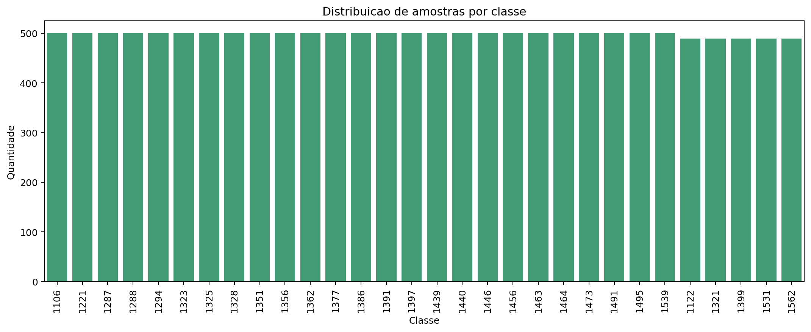
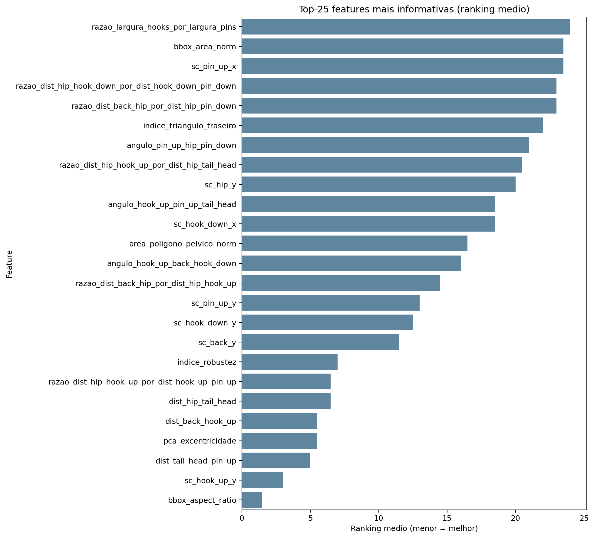
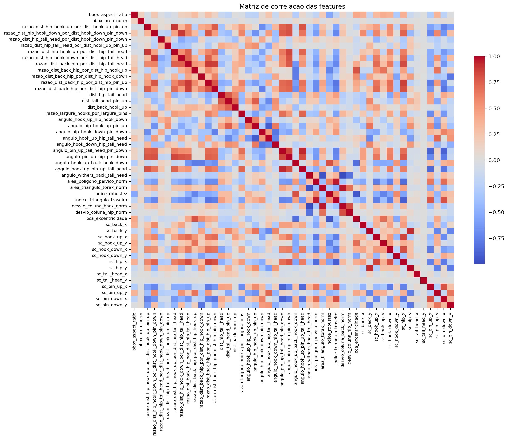
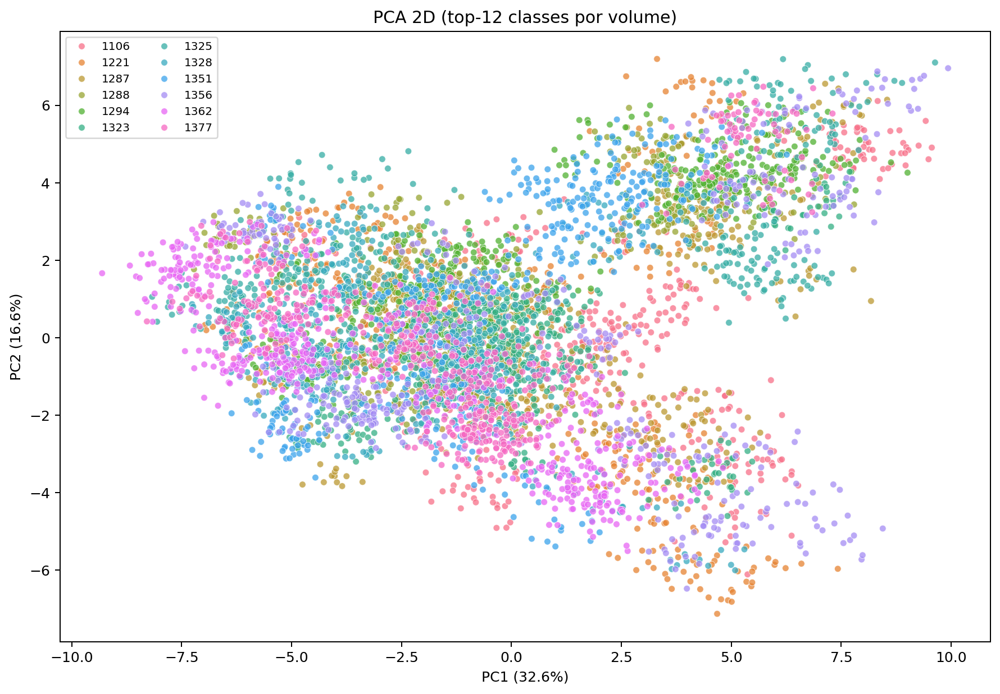
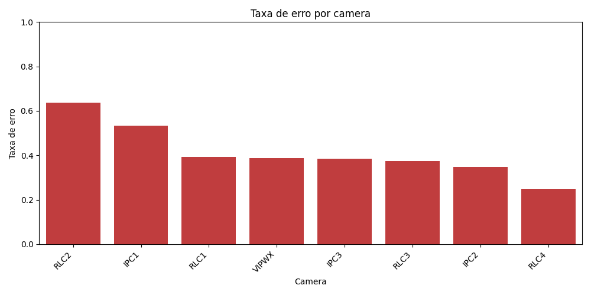
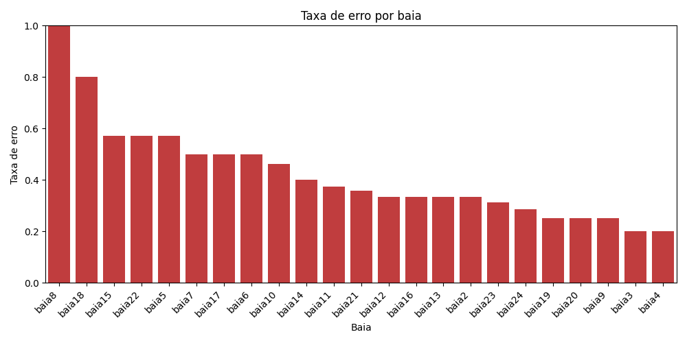

# Relatório de Análise Exploratória de Dados (EDA)

## Projeto

**Identificação de Vacas por Morfologia Corporal utilizando Keypoints e Machine Learning**

---

# 1. Introdução

Este relatório apresenta a **Análise Exploratória de Dados (EDA)** realizada sobre o dataset utilizado no sistema de identificação de vacas baseado em **keypoints anatômicos** detectados por um modelo de pose estimation.

O objetivo da EDA é:

* compreender a estrutura do dataset
* avaliar a qualidade das features extraídas
* identificar redundâncias e problemas nos dados
* analisar a separabilidade entre classes
* orientar melhorias no pipeline de classificação

As conclusões desse relatório foram retiradas dos produtos da execução tanto da pipeline como da pasta saidas deste software. Há arquivos csv, gráficos, arquivos json, etc entre os produtos analisados.

O sistema utiliza **keypoints anatômicos da vaca** para gerar **features geométricas** que representam a morfologia corporal do animal.

Essas features são utilizadas posteriormente por modelos de **classificação supervisionada** para identificar cada vaca individualmente.

---

# 2. Visão Geral do Dataset

## 2.1 Estrutura geral

O dataset utilizado na etapa de classificação possui:

| Propriedade        | Valor        |
| ------------------ | ------------ |
| Amostras totais    | **14.945**   |
| Número de features | **50**       |
| Número de classes  | **30 vacas** |

As features são compostas por:

* distâncias entre keypoints
* razões entre distâncias
* ângulos anatômicos
* áreas de polígonos corporais
* índices morfológicos
* coordenadas normalizadas
* métricas derivadas de PCA

---

## 2.2 Origem das amostras

O dataset contém dois tipos de instâncias:

| Origem                          | Quantidade |
| ------------------------------- | ---------- |
| Dados reais                     | **1.495**  |
| Dados aumentados (augmentation) | **13.450** |

Distribuição aproximada:

```
Dados aumentados ≈ 90%
Dados reais ≈ 10%
```

### Observação

O uso de **data augmentation intensivo** foi necessário devido à quantidade limitada de imagens reais disponíveis para cada vaca.

Entretanto, isso pode gerar alguns efeitos colaterais:

* aprendizado de padrões artificiais
* menor diversidade morfológica real
* aumento do risco de overfitting

---

# 3. Distribuição de Classes

A distribuição de classes apresenta **balanceamento quase perfeito**.

Cada vaca possui aproximadamente:

```
≈ 500 amostras por classe
```



Isso é um aspecto positivo, pois elimina problemas comuns em classificação multiclasse, como:

* viés para classes majoritárias
* baixa representatividade de classes raras
* instabilidade nas métricas de avaliação

Portanto, **o desempenho do modelo não é afetado por desbalanceamento de classes**.

---

# 4. Análise de Features

**Nota:** A descrição completa de cada feature encontra-se no README e no arquivo config/config.yaml

## 4.1 Tipos de Features

As features extraídas representam propriedades geométricas da morfologia da vaca.

Principais categorias:

### Distâncias

Exemplo:

```
dist_tail_head_pin_up
dist_back_hook_up
dist_hip_tail_head
```

Representam relações espaciais entre keypoints.

---

### Razões entre distâncias

Exemplo:

```
razao_dist_hip_hook_up_por_dist_hook_up_pin_up
razao_dist_back_hip_por_dist_hip_hook_up
```

Essas métricas são **invariantes à escala**, o que ajuda a reduzir o impacto de:

* distância da câmera
* tamanho aparente do animal

---

### Ângulos anatômicos

Exemplo:

```
angulo_hook_up_back_hook_down
angulo_pin_up_hip_pin_down
```

Capturam **postura e inclinação corporal**.

---

### Áreas corporais

Exemplo:

```
area_poligono_pelvico_norm
area_triangulo_torax_norm
```

Relacionam-se com **proporções corporais e robustez do animal**.

---

### Índices morfológicos

Exemplo:

```
indice_robustez
indice_triangulo_traseiro
```

Capturam características globais da estrutura corporal.

---

### Coordenadas normalizadas (shape context)

Exemplo:

```
sc_hook_up_y
sc_back_y
sc_pin_up_x
```

Representam posições relativas dos keypoints.

---

### Métricas derivadas de PCA

Exemplo:

```
pca_excentricidade
```

Indicam o grau de alongamento do corpo do animal.

---

# 5. Features Mais Informativas

A importância das features foi estimada utilizando:

* **ANOVA F-score**
* **Mutual Information**

O ranking médio entre esses métodos gerou as **25 features mais informativas**.



## Top features identificadas

Principais variáveis:

1. `bbox_aspect_ratio`
2. `sc_hook_up_y`
3. `dist_tail_head_pin_up`
4. `dist_back_hook_up`
5. `pca_excentricidade`
6. `indice_robustez`
7. `dist_hip_tail_head`
8. `razao_dist_hip_hook_up_por_dist_hook_up_pin_up`

### Interpretação

Essas variáveis capturam características fundamentais da morfologia:

* proporção corporal
* largura do quadril
* comprimento da linha dorsal
* robustez corporal
* inclinação do tronco

Isso sugere que **diferenças morfológicas entre vacas são capturáveis por relações geométricas entre keypoints**.

***Nota:*** Embora essa análise seja relevante e tenha performado muito bem nos testes, a obtenção da importância das melhores features recolhida do resultado do XGBoost e Random Forest produziram resultados ligeiramente melhores.

---

# 6. Redundância de Features

A análise de correlação revelou **alta redundância entre algumas variáveis**.



Exemplos:

```
angulo_withers_back_tail_head
desvio_coluna_back_norm
corr ≈ -0.997
```

```
area_poligono_pelvico_norm
indice_triangulo_traseiro
corr ≈ 0.957
```

Esses valores indicam que algumas features representam **informações praticamente equivalentes**.

Embora isso não seja crítico para redes neurais, pode indicar oportunidades de:

* redução de dimensionalidade
* simplificação do espaço de features

---

# 7. Features Constantes

Durante a análise foram identificadas duas features constantes:

```
sc_withers_x
sc_withers_y
```

Essas variáveis foram removidas da análise de importância.

A constância provavelmente ocorre devido à **normalização espacial aplicada ao sistema de coordenadas dos keypoints**.

---

# 8. Análise de Variância (PCA)

A análise de componentes principais revelou:

| Componente | Variância explicada |
| ---------- | ------------------- |
| PC1        | **32.6%**           |
| PC2        | **16.6%**           |

Variância total explicada pelos dois primeiros componentes:

```
≈ 49%
```

### Interpretação

Isso indica que:

* existe **estrutura no espaço de features**
* porém as classes **não são perfeitamente separáveis linearmente**

Ou seja:

```
as vacas possuem diferenças morfológicas
mas com sobreposição entre algumas classes
```



---

# 9. Observações Sobre o Dataset

Alguns aspectos importantes do problema:

### 1. Forte uso de data augmentation

O dataset contém cerca de:

```
90% dados aumentados
10% dados reais
```

Isso pode influenciar o aprendizado do modelo.

---

### 2. Sobreposição morfológica

Algumas vacas possuem morfologia muito semelhante, o que pode gerar:

* confusão entre classes
* redução na acurácia top-1

---

### 3. Possível ruído de rótulos

Durante a inspeção manual foram identificadas algumas imagens rotuladas incorretamente.

Esse tipo de ruído pode impactar significativamente o desempenho de modelos de classificação.

#### Exemplo de achados
* Não parece ser a 1122
  * 20260102_142810_baia23_IPC2.jpg 
  * 20260102_143606_baia23_VIPWX.jpg
  * 20260106_062334_baia13_IPC1.jpg
  * 20260106_062826_baia13_IPC1.jpg
  * 20260106_062926_baia13_IPC1.jpg
  * 20260106_063026_baia13_IPC1.jpg
  * 20260108_221320_baia17_IPC3.jpg
  * 20260110_215225_baia13_IPC3.jpg
  * RLC1_00_20260103213847_baia12_RLC1.jpg
  * RLC2_00_20260112215726_baia5_RLC2.jpg
  * RLC3_00_20260114063119_baia12_RLC3.jpg


* Não parece ser a 1221
  * 20260108_214019_baia14_IPC2.jpg
  * RLC2_00_20260107220922_baia2_RLC2.jpg
  * RLC2_00_20260107221122_baia2_RLC2.jpg


* Não parece ser a 1294
  * RLC1_00_20260110065652_baia10_RLC1.jpg
  * RLC1_00_20260110065752_baia10_RLC1.jpg


* Não parece ser a 1321
  * 20260101_220011_baia18_IPC2.jpg

* Não parece ser a 1391
  * RLC2_00_20260107145526_baia6_RLC2.jpg
  * RLC3_00_20260104142536_baia6_RLC3.jpg

* Não parece ser a 1397
  * 20260101_221304_baia24_VIPWX.jpg
  * 20260103_070911_baia22_VIPWX.jpg


* Não parece ser a 1531
  * 20260108_073310_baia23_VIPWX.jpg


---

### 4. Influência do contexto de captura

Análises posteriores indicaram que:

* determinadas **câmeras**
* determinadas **baias**

apresentam taxas de erro maiores.

Isso sugere a existência de **diferenças de domínio visual** entre ambientes de captura.






---

# 10. Conclusões da EDA

A análise exploratória revelou diversos aspectos importantes do dataset.

Principais conclusões:

* O dataset apresenta **boa distribuição de classes**.
* As features geométricas capturam **características relevantes da morfologia bovina**.
* Existem **redundâncias entre algumas variáveis**.
* A separabilidade entre classes é **moderada**, indicando que algumas vacas possuem morfologia semelhante.
* O dataset depende fortemente de **data augmentation** devido à limitação de dados reais.

Apesar dessas limitações, os resultados indicam que a **identificação de vacas por morfologia corporal utilizando keypoints é viável**.

---

# 11. Próximos Passos

A partir dos resultados da EDA, algumas direções futuras são recomendadas:

* aumento do número de **imagens reais por vaca**
* redução de redundância entre features
* análise mais detalhada da **matriz de confusão entre classes**
* estudo da influência de **câmeras e baias** no desempenho do modelo

Essas melhorias podem contribuir para o aumento da capacidade de identificação do sistema.

---

# 12. Considerações Finais

Este estudo demonstra que **informações morfológicas extraídas de keypoints anatômicos possuem capacidade discriminativa suficiente para identificação individual de vacas**.

Mesmo utilizando apenas características geométricas, o sistema conseguiu atingir resultados relevantes em um cenário com **30 classes distintas**, evidenciando o potencial da abordagem para aplicações de monitoramento e identificação animal.
